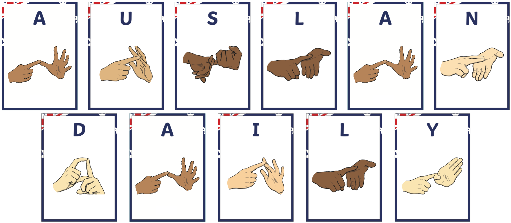

<!--
<head>
    
</head>
<figure class="image-with-caption">
    
    <!-- <figcaption>Spatial Annotation</figcaption> -->
<!-- </figure> -->

**Sign languages (SL)** are natural languages that serve as primary modes of communication for Deaf and hard-of-hearing individuals, enabling rich self-expression and full participation in society.
Like spoken languages, sign languages possess their own grammars and lexicons, and they vary widely across regions—even in places that share a common spoken language.
For example, American Sign Language (ASL) and Australian Sign Language (Auslan) are linguistically distinct, each with unique phonological, lexical, and syntactic features.
To bridge communication between Deaf and hearing communities, sign language translation (SLT) systems have been developed to automatically translate sign videos into spoken languages.

Among sign languages, **fingerspelling (FS)**, the manual representation of alphabets and numbers, plays a critical role in SLT, particularly for expressing proper nouns, technical terms, and items not represented in the standard sign lexicon.
Unlike single-handed systems, such as ASL, BANZSL employs a distinctive two-handed fingerspelling system.
This two-handed system introduces significant challenges for machine translation, such as frequent self-occlusion, high intra-letter variations, and rapid handshape transitions.
Hence, accurate recognition of fingerspelling is crucial, as it frequently conveys essential semantic content, such as named entities, numerical data, and domain-specific vocabulary that lack conventional sign equivalents.

Despite significant progress in sign language research, most publicly available datasets focus on single-handed fingerspelling understanding task, such as those used in ASL and GSL, leaving the two-handed fingerspelling system of BANZSL comparatively underexplored.
Moreover, existing datasets often lack the scale and linguistic realism required for fingerspelling research.
In particular, they rarely capture naturally occurring phenomena, such as spelling errors, lexical abbreviations, acronyms, and inline corrections, which are commonly encountered in practical scenarios.
This highlights a critical gap: the need for a large-scale, real-world BANZSL fingerspelling dataset to facilitate the study on BSL, Auslan and NZSL.

To address this gap, we introduce **BANZ-FS**, a large-scale dataset dedicated to BANZSL fingerspelling, collected from both real-world and controlled environments.
BANZ-FS integrates multiple sources to reflect diverse and authentic usage scenarios: (1) professional live Auslan interpretations from ABC News with Auslan2 broadcasts (capturing formal, high-register discourse); (2) controlled laboratory recordings (offering clean, high-quality reference data); and (3) user-generated vlog content from online platforms and social media (representing casual, daily communication).
This diverse composition allows BANZ-FS to capture a broad spectrum of signing tempos and registers, from formal broadcast interpretation to everyday interaction.

Specifically, **BANZ-FS** comprises more than 35,000 aligned fingerspelling instances.
During annotating fingerspelling, we additionally align 40 hours of Auslan news footage, which not only substantially extends the prior benchmark Auslan-Daily News but also allows us to investigate recognition accuracy of fingerspelling within contexts.
Our annotation protocol includes fine-grained alignment across video ↔ subtitles, video ↔ fingerspelled letters, and video ↔ target lexicons.
We explicitly annotate and categorize key linguistic phenomena prevalent in fingerspelling, including abbreviations, acronyms, misspellings, and inline corrections.
Furthermore, our proposed dataset captures the visual and articulatory complexities inherent in two-handed fingerspelling systems, underscoring the challenges of accurate fingerspelling recognition in BANZSL.
