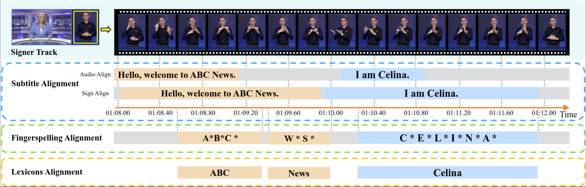
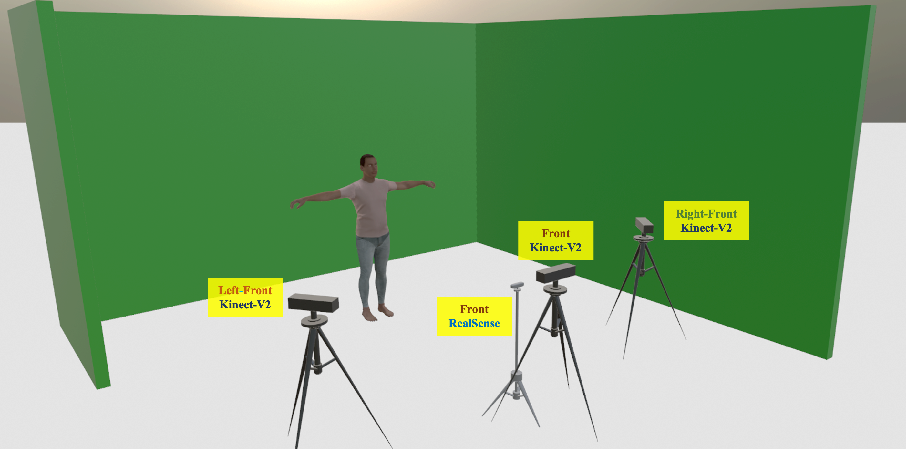

<head>
    
</head>

## Collection, Cleaning and Labelling Procedure for Web Data

**Collection.**
“ABC News with Auslan” and YouTube sources are open sources.
Beginning in 2022, “ABC News with Auslan” has provided weekly broadcasts covering key domestic and international news events, as well as weather forecasts.
It is an ongoing program, and previous work aligned 45 videos collected up to May 2023, along with a small number of fingerspelling annotations.
In this work, we extend the collection by acquiring an additional 80 videos spanning from May 2023 to April 2025.
These broadcasts feature live sign language translation (simultaneous interpretation) by Auslan experts, intended for deaf and hearing-impaired viewers.
News content inherently includes a rich set of fingerspelling scenarios, such as personal names, place names, organization names, phone numbers, and other proper nouns, making it an ideal source for studying fingerspelling phenomena.
To further diversify our dataset, we also include several high-quality publicly available documentaries and educational videos interpreted with BSL and NZSL, primarily sourced from YouTube.
These videos typically feature daily conversations, learning activities, or introductions to specific topics.

**Cleaning.**
All original videos are accompanied by standard English dubbing and subtitles.
We retrieve subtitles for each complete video, formatted as “[Start Time] subtitle [End Time]”, with timing aligned to the spoken dubbing.
Following the subtitle cleaning strategy proposed in Auslan-Daily, we perform simple cleaning operations: merge fragments ending in commas with their subsequent lines, split overlapping subtitles into separate sentences, and discard entries with only non-semantic fillers.
As a result, we obtain approximately 30K complete and cleaned subtitles requiring further alignment with fingerspelling segments.

 
<figure class="image-with-caption">
    
    <figcaption> Anotation Process.</figcaption>
</figure>
 

**Labelling.**
To annotate fingerspelling instances, we invited experienced Auslan experts to assist in the labelling process.
In particular, for news videos, we additionally perform temporal alignment to ensure segment-level consistency.
For each video, we first employ AlphaPose to track all individuals in the scene.
The annotation process proceeds in several steps: (1) verify and refine video-subtitle alignment; (2) identify the signer ID based on pose trajectories; (3) if fingerspelling is present, annotate the corresponding temporal segment; and (4) retrieve the associated target lexicon from the subtitle, if it exists.
To guarantee the annotation quality of our dataset, we conduct a cross-check verification process during each data labelling procedure stage.
Specifically, we ask each Auslan annotator as an examiner to cross-check around 5% of annotated video clips provided by another annotator.
The video clips are chosen randomly. If the examiner finds more than 10% of annotated videos have obvious errors, a third annotator is invited to review and correct the annotations.
Through the collaborative efforts of five Auslan experts and five annotators, we complete all annotations with approximately 500 work hours.
Overall, our dataset contains the following annotations: (1) temporal boundaries of sign video clips; (2) temporal boundaries of fingerspellings; (3) lexical forms of fingerspellings; and (4) English transcriptions.
These annotations can be further investigated for fingerspelling-related tasks.

 

## Collection for Lab Data

To complement our web data, followed by MM-WLAuslan, we record lab-controlled videos using a multi-camera RGB-D setup.
The recording studio is equipped with a green screen and includes three Kinect-V2 cameras positioned at left-front, front, and right-front angles, along with a centrally placed RealSense camera.
We invite participants with diverse Auslan experience, including deaf individuals, Auslan experts, and sign language learners.
Participants are instructed to perform frequently used fingerspelling words and expressions commonly encountered in daily communication contexts.
Each sign instance is verified by at least one expert to ensure expression accuracy, while the inclusion of volunteers enhances signer diversity and realism.
This setup facilitates the study of cross-camera robustness and supports high-quality benchmarking under controlled conditions.

 
<figure class="image-with-caption">
    
    <figcaption>Schematic diagram of our recording studio.</figcaption>
</figure>
 

