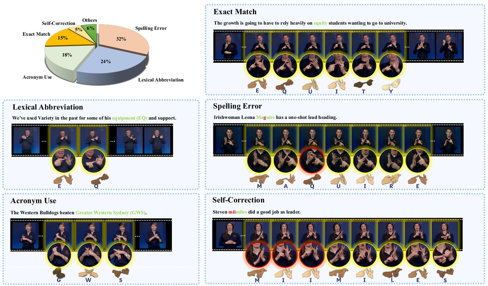

<head>
    
</head>

We explicitly annotate and categorize key linguistic phenomena prevalent in fingerspelling, including abbreviations, acronyms, misspellings, and inline corrections.
The pie chart (top-left) illustrates the proportion of different fingerspelling phenomena annotated within the dataset.
Representative examples below highlight diverse real-world cases, such as exact matches (“equity”), lexical abbreviations (“equipment” → “EQ”), spelling errors (“Maguire“ misspelled as “Maquire”), acronym use (“Greater Western Sydney” → “GWS”), and inline corrections (“miimiles” corrected to “miles”).

<figure class="image-with-caption">
    
    <!-- <figcaption>Spatial Annotation</figcaption> -->
</figure>
