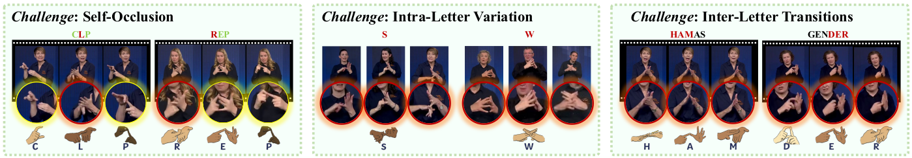

<head>
    
</head>

Two-handed system introduces significant challenges for machine translation, such as frequent self-occlusion, high intra-letter variations, and rapid handshape transitions.
Our proposed dataset captures the visual and articulatory complexities inherent in two-handed finger-spelling systems, underscoring the challenges of accurate fingerspelling recognition in BANZSL.
As shown in follow image, it highlights key visual challenges specific to two-handed fingerspelling systems, such as self-occlusion, intra-letter variation, and rapid inter-letter transitions, further underscoring the complexity of accurate fingerspelling recognition and translation in BANZSL.

<figure class="image-with-caption">
    
    <!-- <figcaption>Spatial Annotation</figcaption> -->
</figure>

