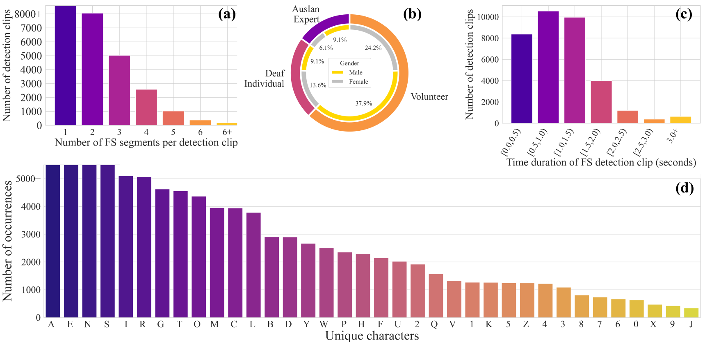
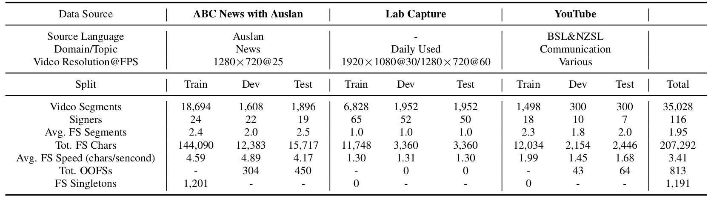

<head>
    
</head>

## Data Statistics of BANZ-FS

<figure class="image-with-caption">
    
    <figcaption>(a) Distribution of the number of fingerspelling (FS) segments per clip. (b) Distribution of FS clip durations. (c) Distribution of signer demographics categorized by Auslan proficiency and gender. (d) Character frequency distribution across all FS clips.</figcaption>
</figure>
 

We present key statistics of BANZ-FS to highlight the diversity and complexity of the dataset.
BANZ-FS consists of over 35,000 annotated video segments sourced from news broadcasts, lab recordings, and online videos, covering 116 unique signers. The dataset is split into training, development, and test sets to facilitate fair evaluation of fingerspelling-related tasks.
We segment each video by applying a 10-second sliding window around any detected FS segment.
As a result, each detection clip may contain multiple FS instances.
As shown in Figure 3, most clips contain only 1–2 FS segments and last less than 1.5 seconds, indicating that FS is often embedded briefly within continuous signing.
Furthermore, the signer population includes a balanced mix of Auslan experts, deaf individuals, and volunteers, offering a wide range of signing styles and linguistic competence.
The FS character distribution reveals a long-tail pattern: common letters such as A, E, and N appear frequently, while rare characters (e.g., numerals and less frequent letters) occur sparsely.
This imbalance poses additional challenges for generalization and open-vocabulary recognition, especially in low-resource conditions.

 
<figure class="image-with-caption">
    
    <figcaption>Key statistics of the BANZ-FS dataset across three data sources: ABC News with Auslan, Lab Capture, and YouTube. OOFS (out-of-training FS strings) are FS sequences that never appear in the training set, while FS Singletons occur only once in training.</figcaption>
</figure>
 

In addition, we report the number of out-of-training FS strings (OOFS) and FS singletons in Table, which quantify the presence of unseen or rare FS sequences and further reflect the open-set nature of the task.

