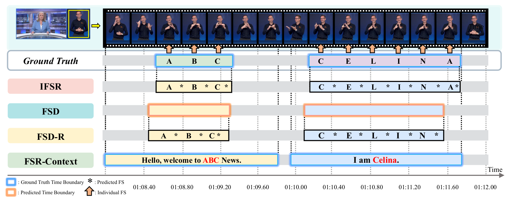
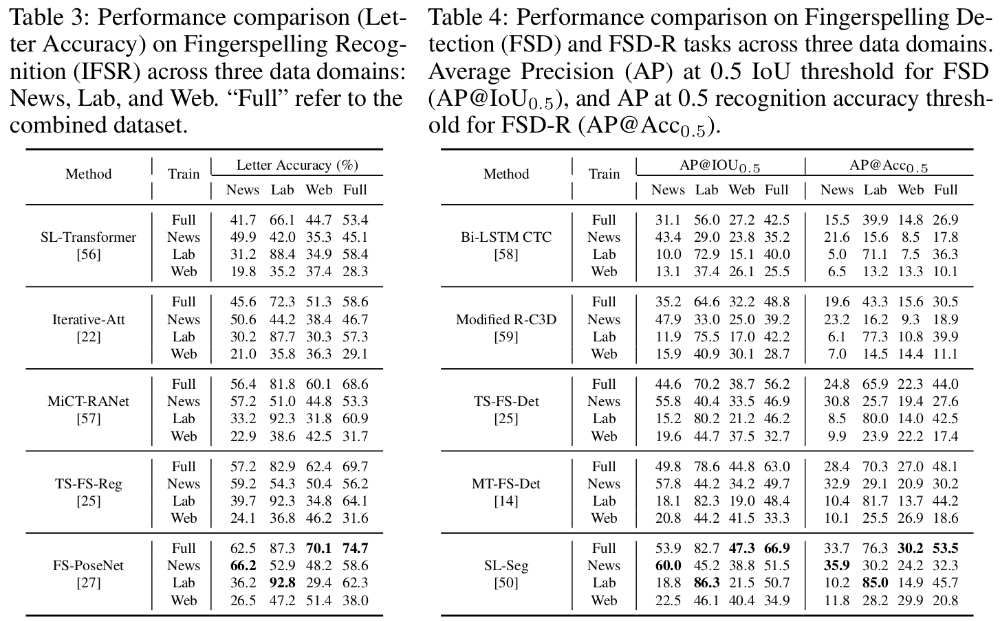

<head>
    

    
    
</head>

## Fingerspelling-Related Tasks

<figure class="image-with-caption">
    
    <figcaption>Overview of fingerspelling-related tasks in our BANZ-FS dataset.</figcaption>
</figure>
 

We provide an overview of the BANZSL-FS benchmark tasks and their corresponding evaluation metrics:

 

### **Isolated Fingerspelling Recognition (IFSR)**

Given a segmented fingerspelling clip the goal of IFSR is to transcribe it into the corresponding letter sequence.

**Evaluation Metric**: **Letter Accuracy**
Defined as:

$$
1 - \frac{\text{EditDistance}(L^*, \hat{L})}{|L^*|},
$$

where $L^*$ is the ground-truth letter sequence and $\hat{L}$ is the predicted sequence.
This edit-distance-based metric captures correctness, accounting for insertions, deletions, and substitutions.

---
 
### **Fingerspelling Detection (FSD)**

Given an untrimmed sign language video with $T$ frames, the goal of FSD is to identify temporal segments $(f_s, f_e)$ that localize fingerspelling intervals within $\mathbb{V}$.

**Evaluation Metric**: **AP@IoU**
- Average Precision is calculated based on temporal Intersection-over-Union (IoU) between predicted and ground-truth segments.
- Higher IoU thresholds reflect stricter localization accuracy.

---
 
### **Fingerspelling Detection followed by Recognition (FSD-R)**

This is a two-stage approach:
1. An FSD model predicts temporal segments from an untrimmed sign language video.
2. Each predicted segment is processed by a fingerspelling recognizer to generate the corresponding letter sequence.

**Evaluation Metric**: **AP@Acc**
- Average Precision is computed using the **accuracy of the recognizer** on each predicted segment.
- A prediction is considered correct if its **recognition accuracy exceeds a defined threshold**, ensuring that detected segments are not only well-localized but also **interpretable**.

---

### **Fingerspelling Recognition in Context (FSR-Context)**

Given a full sentence-level sign language video $\mathbb{V}$ and its predicted spoken language translation $\hat{T}$,
the task is to evaluate how accurately the model transcribes **fingerspelled terms embedded in the sentence**.

Fingerspelled spans annotated in the video are aligned with corresponding spans in $\hat{T}$, and **character-level accuracy** is measured.

**Evaluation Metric**: **Letter Accuracy**
 

 
 

### Baseline Models

<figure class="image-with-caption">
    
    <figcaption>Overview of fingerspelling-related tasks in our BANZ-FS dataset.</figcaption>
</figure>
 

We mention that all models used in this work are publicly available. We express profound gratitude to the aforementioned authors for their invaluable contributions. Each of the ISLR models we use is linked below:

- Isolated Fingerspelling Recognition (IFSR)
  - SL-Transformer [GitHub](https://github.com/neccam/slt)
  - Iterative-Att [GitHub]()
  - MiCT-RANet [GitHub]()
  - TS-FS-Reg [GitHub](https://github.com/FangyunWei/SLRT)
  - FS-PoseNet [GitHub]()

- Fingerspelling Detection (FSD) and Fingerspelling Detection followed by Recognition (FSD-R)
  - Bi-LSTM CTC [GitHub]()
  - Modified R-C3D [GitHub]()
  - TS-FS-Det [GitHub](https://github.com/FangyunWei/SLRT)
  - MT-FS-Det [GitHub]()
  - SL-Seg [GitHub](https://github.com/sign-language-processing/segmentation)

