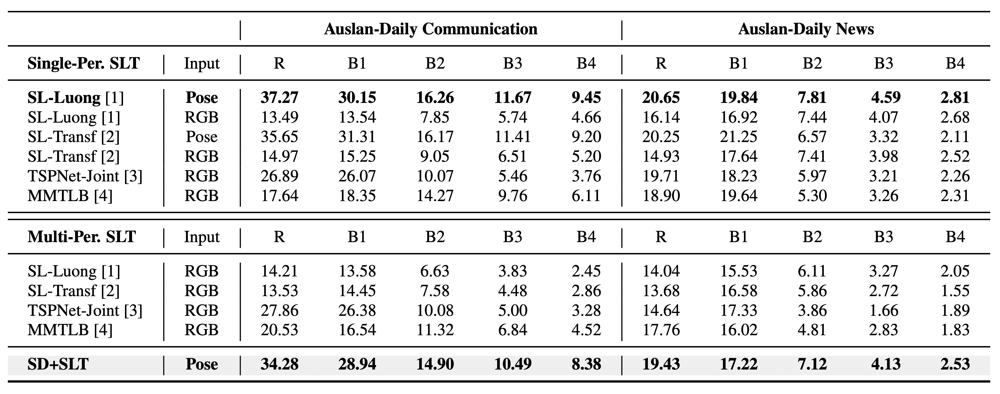

<head>
    
</head>

## Sign Language Translation

Sign Language Translation (SLT) is the task of automatically converting sign language video sequences into grammatically correct and semantically equivalent spoken language text.
Unlike sign language recognition, which outputs glosses or lexical units in a one-to-one fashion, SLT aims to bridge the modality and linguistic gap between visual-gestural communication and spoken language by modeling complex syntax, coarticulation effects, and context-dependent expressions.
The task typically involves processing continuous sign streams, extracting spatio-temporal features, and generating natural language sentences that preserve the intended meaning of the original signed content.
SLT is particularly challenging due to the lack of large-scale annotated parallel corpora, signer and domain variability, and structural differences between sign and spoken languages.

### Data Statistics of Auslan-Daily New V2

<figure class="image-with-caption">
    
    <figcaption>Key statistics of Auslan-Daily New V1 and Auslan-Daily New V2. OOV: out-of-vocabulary. Singleton: words that only occur once in the training dataset.</figcaption>
</figure>

 
 

Above Table presents a detailed comparison between the Auslan-Daily News V1 and V2 sub-datasets in terms of data volume, diversity, and vocabulary statistics.
V2 significantly expands upon V1, featuring nearly twice the number of annotated segments (29,669 vs. 11,065), frames (5.6M vs. 2.3M), and total words (492,624 vs. 188,774).
It also includes a larger vocabulary size (15,976 vs. 12,346) and more signers (27 vs. 18), reflecting improved linguistic and signer diversity.
The number of out-of-vocabulary (OOV) words and singletons further illustrates the dataset’s long-tail distribution, which presents both challenges and opportunities for robust model training and generalization.

 
 

## Benchmark of Auslan-Daily News V2 on Sign Language Translation

<figure class="image-with-caption">
    
    <figcaption>Translation results of Single-Person SLT and Multi-Person SLT models on Auslan-Daily New V2.</figcaption>
</figure>

 
 

We mention that all models used in this work are publicly available. We express profound gratitude to the aforementioned authors for their invaluable contributions. Each of the ISLR models we use is linked below:

- SL-Transformer [GitHub](https://github.com/neccam/slt)
- Iterative-Att [GitHub](https://github.com/chevalierNoir/FS-Detection)
- MiCT-RANet [GitHub](https://github.com/fmahoudeau/MiCT-RANet-ASL-FingerSpelling)
- TS-FS-Reg [GitHub](https://github.com/FangyunWei/SLRT)
- FS-PoseNet [GitHub](https://github.com/pooyafayyaz/Fingerspelling-PoseNet)

